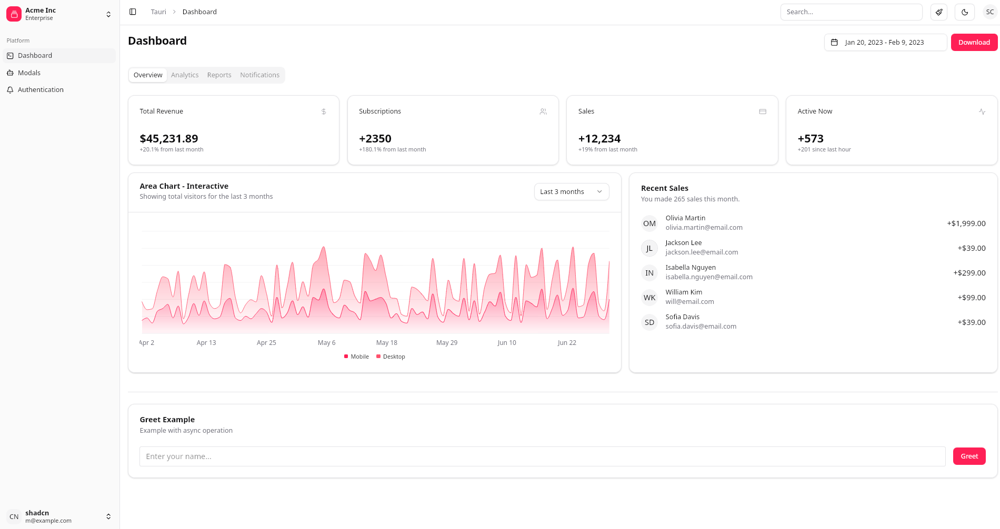

# Tauri + Vue + TypeScript + Shadcn-vue



This template should help get you started developing with Tauri, Vue 3, TypeScript and Shadcn-vue in Vite.

## Prerequisites

- **Node.js** (v18 or higher)
- **Rust** and **Cargo** (for Tauri)
- **Package Manager**: [Bun](https://bun.sh/) (recommended) or [npm]

### Installing Rust

```bash
curl --proto '=https' --tlsv1.2 -sSf https://sh.rustup.rs | sh
```

## Getting Started

### Option 1: Using Bun (Recommended)

```bash
# Install dependencies
bun install

# Start development server
bun run tauri dev
```

### Option 2: Using npm

```bash
# Install dependencies
npm install

# Start development server
npm run tauri dev
```

## Project Structure

```
  src/                 # Vue application source code
  src-tauri/           # Tauri Rust backend
  public/              # Static assets
  dist/                # Build output
```

## Development

The development server will automatically:
- Compile your Vue application
- Launch the Tauri window
- Enable hot reloading for both frontend and backend changes

## Building for Production

```bash
# Using Bun
bun run tauri build

# Using npm
npm run tauri build
```

The built application will be located in `src-tauri/target/release/bundle/`.


## UI Components

This project uses a comprehensive set of UI components built with modern design principles:

### Component Library
- **shadcn-vue**: Vue port of shadcn/ui components built on Radix UI primitives
- **Reka UI**: Headless Vue components for accessibility foundations
- **Custom Components**: Tailored components in `src/components/ui/`

## Adding shadcn-vue Components

This project uses shadcn-vue CLI for component management. Components are automatically configured with your project's styling and TypeScript setup.

### Installation Commands

```bash
# Add a single component
bunx shadcn-vue@latest add button

# Add multiple components
bunx shadcn-vue@latest add button card input label

# Add with overwrite (if component exists)
bunx shadcn-vue@latest add button --overwrite

# Add all available components
bunx shadcn-vue@latest add --all

# Skip confirmation prompts
bunx shadcn-vue@latest add button --yes
```

### Using Added Components

Once installed, components can be imported and used like this:

```vue
<script setup lang="ts">
import { Badge } from '@/components/ui/badge'
import { Switch } from '@/components/ui/switch'
</script>

<template>
  <Badge variant="default">New</Badge>
  <Switch />
</template>
```

Components are automatically added to `src/components/ui/` and can be imported using the path aliases defined in `components.json`.
